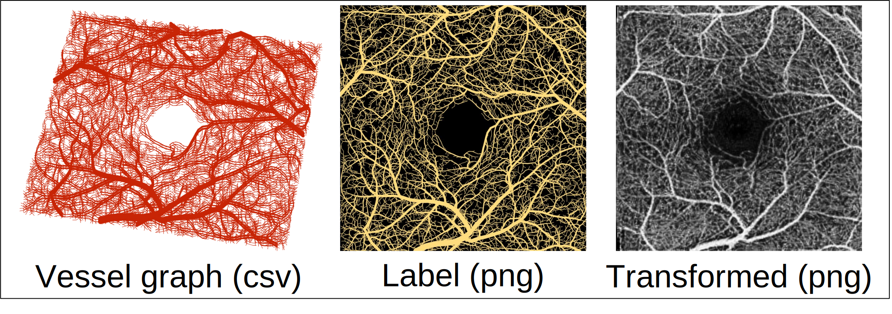

# Synthetic Dataset
<div style="text-align:center">
    
</div>

We provide 500 synthetic training samples at `./images/`, their corresponding labels at `./labels/`, and the vessel graphs their based on at `./vessel_graphs`. The code for vessel graph generation can be found under `../vessel_graph_generation`. To generate [N] new samples as used in the paper use the docker script:
```sh
docker run -v [RESULT_DIR]:/var/generation octa-seg generation [N]
``` 

You can also generate your own synthetic samples with a customized config (e.g. [./vessel_graph_generation/configs/dataset_18_June_2023.yml](./vessel_graph_generation/configs/dataset_18_June_2023.yml)). Run from project folder:
```sh
# This will generate 500 samples at `./vessel_graph_generation/datasets/dataset_18_June_2023/`
python generate_vessel_graph.py --config_file ./vessel_graph_generation/configs/dataset_18_June_2023.yml --num_samples 500
```

To visualize them run:
```sh
# Create images
python ./datasets/visualize_vessel_graphs.py --source_dir ./datasets/dataset_18_June_2023 --out_dir ./datasets/dataset_18_June_2023_png --factor 4

# Create label maps
python ./datasets/visualize_vessel_graphs.py --source_dir ./datasets/synth_csv --out_dir ./datasets/dataset_18_June_2023_label_png --factor 16 --binarize
```

To turn them into realistic images, **transform** the images using a pretrained GAN. Update the source path in the model config file and run:
```sh
python test.py --config_file [PATH_TO_CONFIG_FILE] --epoch [EPOCH]
```