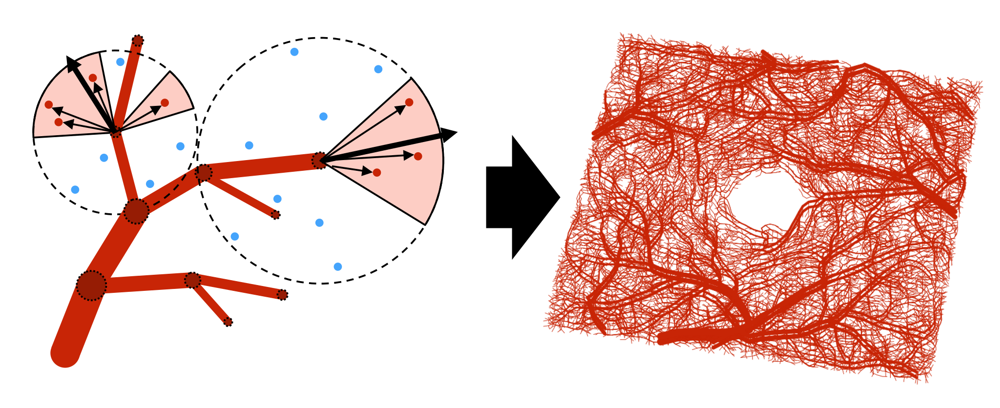
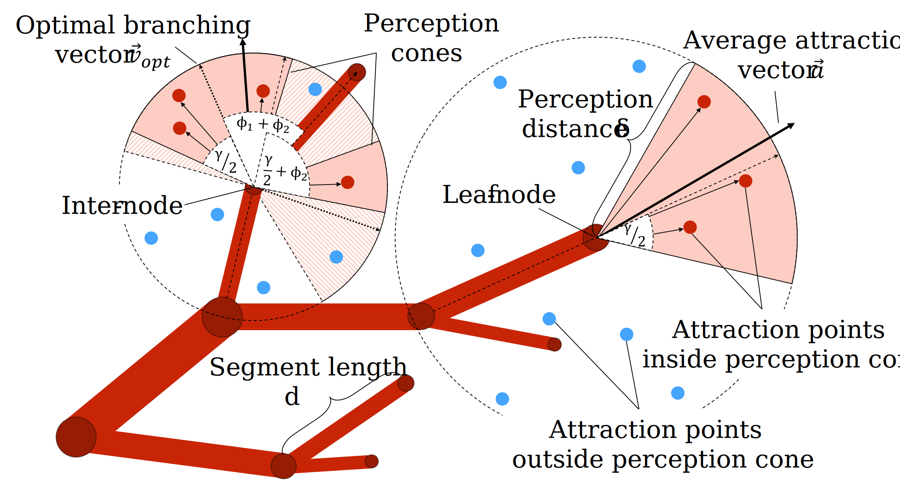

# Statistical simulation of the retinal vasculature
A central component of our pipeline is the realistic simulation of retinal vasculature. Originating from the optical nerve, blood vessels traverse the entire retina as two vascular complexes. The superficial vascular complex (SVC) mostly contains larger vessels, while the deep vascular complex (DVC) consists primarily of capillaries with a radius as small as 2.5 μm [[1]](https://www.nature.com/articles/srep42201). The retina also contains a circular shaped avascular zone around the fovea (FAZ) of about 0.35 mm in diameter. Similar to other works, we simulate vessel development using a forest of 3D rooted binary trees. Growth of these graphs is governed by a set of predefined rules. Each tree is initialized by a root node with a single child node. Each edge encodes the length and radius of a vessel segment.

[Rauch and Harders (2021)](https://diglib.eg.org/handle/10.2312/egs20211012) present an angiogenesis model using a statistical approach based on space colonization [[2]](https://diglib.eg.org/handle/10.2312/egs20211012). In this work, we reimplemented their approach  in python and adapted it to facilitate retinal vessel simulation.

Clinicians often prefer the 2D *en-face* projection representation of OCTA data instead of the 3D volume. We therefore relax the realism in depth, as we are only interested in the resulting maximum intensity projection (MIP) along the z-axis.

    

## How it works:
The circulatory system is modelled with oxygen-providing arterial trees and CO₂-removing venous trees. Instead of explicitly computing the oxygen distribution, the authors propose to randomly place $N$ oxygen sinks in the simulation space every iteration. Each oxygen sink acts as an attraction point for the closest arterial node within its range $\delta$. Each oxygen sink must have a minimal distance $\epsilon_n$ to nearby vessel nodes and a minimal distance $\epsilon_s$ to existing oxygen drains. Once a new vessel node is placed within range $\epsilon_k$ of an attraction point, the attraction point is considered saturated and is turned into a CO₂ source. These CO₂ emitters now act as attraction points for venous trees, whose growth process follows analogue to arterial trees. Once CO₂ sources are satisfied, they are removed.

    

## Implementation Details
To simulate the geometrical shape of a $3\times3$ mm² central crop of the retina, we define a [simulation space](./simulation_space.py) as a slab with dimensions of $1\times1\times \frac{1}{76}$.

We simulate vessel development using a [forest](./forest.py) of 3D rooted binary [trees](./arterial_tree.py).
Since the optical nerve is located outside the FOV, we initialize the [Forest](./forest.py) by randomly place 16 root stumps at the lateral faces of the simulation space cuboid.

The [greenhouse](./greenhouse.py) handles the growth process. In each growth iteration, we perform the following steps:

1. Oxygen sink placement: Randomly place $N$ oxygen sinks in the simulation space.
2. Assign oxygen sinks to the closest arterial node. We use [Open3D's KdTree implementation](./element_mesh.py) to efficient query elements based on their location in 3D space.
3. Growth:
    
    A) Leaf-node proliferation:

    3. A) i). Every leaf node has a perception cone with angle $\gamma$ and distance $\delta$ (see figure). We *elongate* the segment and place a new child node in the direction of the mean attraction vector.

    3. A) ii). If the angle of all attraction vectors is larger than a threshold $\phi$, a *bifurcation* is initiated instead and two child nodes are added. The angles $\alpha$ and $\beta$ from $\vec{a}$ to the child segments are calculated following Murray's law of minimum work.

    B) Inter-nose sprouting: Attraction points are considered by an inter-node if they lay within the frustum of a sphere with radius $\delta$. The closest optimal branching vector $\vec{v}_{\textnormal{opt}} \in S_{\vec{v}_{\textnormal{opt}}}$ to the average attraction vector $\vec{a}$ is used for proliferation.

4. Conversion of satisfied oxygen sinks into CO₂ sources.

5. Assign CO₂ sources to venous nodes.

6. Growth of venous trees (see 3.)

7. Removal of satisfied CO₂ sources

8.  Simulation space expansion (aka. adjustment of distance parameters)

After $I$ iterations, the vessel graph is [turned into a grayscale image](./tree2img.py).
